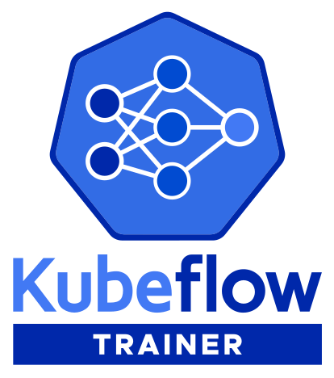

# Kubeflow Trainer

<h1 align="center">
    
   
</h1>

## Overview

Kubeflow Trainer is a Kubernetes-native project designed for large language models (LLMs)
fine-tuning and enabling scalable, distributed training of machine learning (ML) models across
various frameworks, including PyTorch, JAX, TensorFlow, and others.

You can integrate other ML libraries such as [HuggingFace](https://huggingface.co),
[DeepSpeed](https://github.com/microsoft/DeepSpeed), or [Megatron-LM](https://github.com/NVIDIA/Megatron-LM)
with Kubeflow Training to orchestrate their ML training on Kubernetes.

Kubeflow Trainer allows you effortlessly develop your LLMs with the Kubeflow Python SDK and
build Kubernetes-native Training Runtimes with Kubernetes Custom Resources APIs.

<h1 align="center">
    
   
</h1>

## Kubeflow Trainer Introduction

The following KubeCon + CloudNativeCon 2024 talk provides an overview of Kubeflow Trainer capabilities:

## Getting Started

Please check [the official Kubeflow documentation](https://www.kubeflow.org/docs/components/trainer/getting-started)
to install and get started with Kubeflow Trainer.

## Community

The following links provide information on how to get involved in the community:

- Join our [`#kubeflow-training` Slack channel](https://www.kubeflow.org/docs/about/community/#kubeflow-slack).
- Attend [the bi-weekly AutoML and Training Working Group](https://bit.ly/2PWVCkV) community meeting.
- Check out [who is using Kubeflow Trainer](ADOPTERS.md).

## Contributing

Please refer to the [CONTRIBUTING guide](CONTRIBUTING.md).

## Changelog

Please refer to the [CHANGELOG](CHANGELOG.md).

## Kubeflow Training Operator V1

Kubeflow Trainer project is currently in <strong>alpha</strong> status, and APIs may change.
If you are using Kubeflow Training Operator V1, please refer [to this migration document](https://www.kubeflow.org/docs/components/trainer/operator-guides/migration/).

Kubeflow Community will maintain the Training Operator V1 source code at
[the `release-1.9` branch](https://github.com/kubeflow/training-operator/tree/release-1.9).

You can find the documentation for Kubeflow Training Operator V1 in [these guides](https://www.kubeflow.org/docs/components/trainer/legacy-v1).

## Acknowledgement

This project was originally started as a distributed training operator for TensorFlow and later we
merged efforts from other Kubeflow Training Operators to provide a unified and simplified experience
for both users and developers. We are very grateful to all who filed issues or helped resolve them,
asked and answered questions, and were part of inspiring discussions.
We'd also like to thank everyone who's contributed to and maintained the original operators.

- PyTorch Operator: [list of contributors](https://github.com/kubeflow/pytorch-operator/graphs/contributors)
  and [maintainers](https://github.com/kubeflow/pytorch-operator/blob/master/OWNERS).
- MPI Operator: [list of contributors](https://github.com/kubeflow/mpi-operator/graphs/contributors)
  and [maintainers](https://github.com/kubeflow/mpi-operator/blob/master/OWNERS).
- XGBoost Operator: [list of contributors](https://github.com/kubeflow/xgboost-operator/graphs/contributors)
  and [maintainers](https://github.com/kubeflow/xgboost-operator/blob/master/OWNERS).
- Common library: [list of contributors](https://github.com/kubeflow/common/graphs/contributors) and
  [maintainers](https://github.com/kubeflow/common/blob/master/OWNERS).
