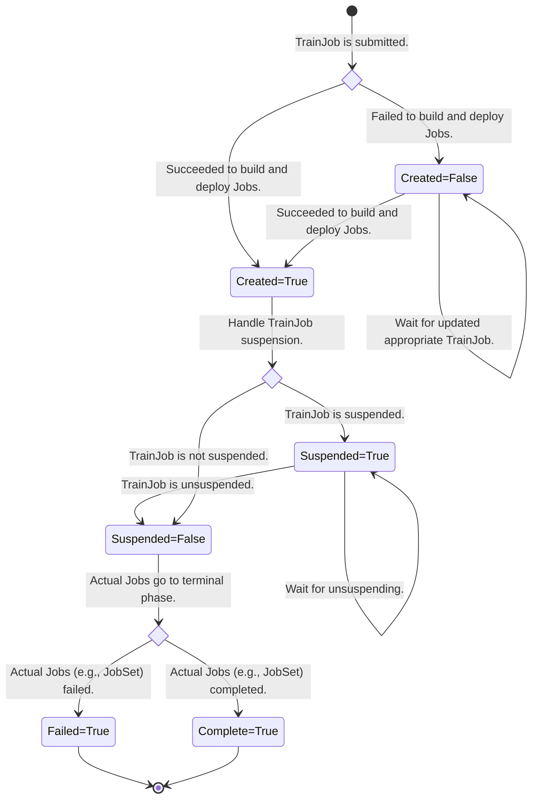

# KEP-2170: Kubeflow Training V2 API

## Authors

- Andrey Velichkevich - [@andreyvelich](https://github.com/andreyvelich)
- Yuki Iwai - [@tenzen-y](https://github.com/tenzen-y)

Creation date: 2024-07-16

Google doc: https://bit.ly/3WzjTlw

## Overview

This document discusses the new Kubeflow Training V2 API.

When we built the
[Kubeflow Training Operator a couple of years ago](https://docs.google.com/document/d/1x1JPDQfDMIbnoQRftDH1IzGU0qvHGSU4W6Jl4rJLPhI/edit?usp=sharing),
Kubernetes lacked better features to support distributed machine learning (ML) training, such as
[SuccessPolicy](https://kubernetes.io/docs/concepts/workloads/controllers/job/#success-policy)
and RestartPolicy ([PodFailurePolicy](https://kubernetes.io/docs/concepts/workloads/controllers/job/#pod-failure-policy) in `Job`).
Recently, the Kubernetes community launched the working group Batch, and then the working group
actively worked on evolving the batch/v1 `Job` API
and built [a new Kubernetes SIGs project: `JobSet`](https://github.com/kubernetes-sigs/jobset) to
manage groups of `Jobs`.

This document consolidates efforts for the Cloud Native ML Training between Kubeflow and Kubernetes
communities.

## Motivation

We often implement features similar to batch/v1 `Job`, such as “suspend”, on the Training Operator
side since the Training Operator creates blocks of plain Pod and Service for each rank once
Kubeflow Jobs are created. However, if we continue taking the same approach to use lowest level
abstractions that introduce redundancy, the maintenance costs will continue to increase.

Replacing repetitive infrastructure layers with `JobSet` would help to avoid redundancy and reduce
developer toil.

Additionally, introducing `JobSet` as an infrastructure layer would allow us to introduce batch
workload features such as
[the PodFailurePolicy](https://kubernetes.io/docs/concepts/workloads/controllers/job/#pod-failure-policy)
and [the PodDisruptionCondition](https://kubernetes.io/docs/concepts/workloads/controllers/job/#handling-pod-and-container-failures)
easily.

Please also see the [Kubernetes JobSet and Kubeflow Training Operator collaboration document](https://docs.google.com/document/d/1C2ev7yRbnMTlQWbQCfX7BCCHcLIAGW2MP9f7YeKl2Ck/edit?usp=sharing).

### User Value

In addition to the above motivation, we will address the following user feedback while implementation:

- Confusion around Workers: https://github.com/kubeflow/training-operator/issues/1790
- Support batch/v1 `Job` features: https://github.com/kubeflow/training-operator/issues/1718
- ExitCodes for PodFailurePolicy: https://github.com/kubeflow/training-operator/issues/1749
- Migrate to MPI V2 API: https://github.com/kubeflow/training-operator/issues/1906

### Personas

We can identify the following personas of Training Operator:

1. **DevOps Engineer**. They are familiar with Kubernetes concepts and they know how to manage the
   Kubernetes workloads. Usually, they are not experts in ML frameworks and ML algorithms.
1. **MLOps Engineer**. They are familiar with ML frameworks and they know how to configure
   distributed PyTorch settings such as rendezvous backends or MPI configuration. Usually, they are
   not experts in Kubernetes and ML algorithms.
1. **Data Scientists/ML Engineers**. They create model architectures and advanced ML algorithms to train models.
   They prefer to use Python for their work. They are aware of `torch.nn` APIs, but not with
   `torch.distributed` and Kubernetes concepts to scale model training.

Based on the above personas, we should build an API that everyone will benefit from.

### Goals

- Introduce the `TrainingRuntime` and `ClusterTrainingRuntime` APIs that will store blueprints
  for model training and LLM fine-tuning using various ML frameworks. These runtimes will be built
  on top of `JobSet` APIs with additional functionality for special use-cases.
  For example, training using MPI orchestration.
- Introduce Kubeflow `TrainJob` API that allows to reuse these runtimes and quickly start a new
  training job without understanding complex Kubernetes APIs.
- Update Kubeflow Training SDK to allow data scientists quickly create and monitor `TrainJobs`.
- Create community-supported `ClusterTrainingRuntime` for distributed training with PyTorch and MPI.
- Create community-supported `ClusterTrainingRuntime` for LLM fine-tuning for various foundational
  models (e.g. Mistral, LLama-70b, Gemma-7b).
- Work on the following `JobSet` improvements:
  - For PyTorch Elastic: https://github.com/kubernetes-sigs/jobset/issues/463
  - For PVC management: https://github.com/kubernetes-sigs/jobset/issues/572
  - For PyTorch Elastic: https://github.com/kubernetes-sigs/jobset/issues/570
- Integrate `TrainJob` with Kueue and MultiKueue to effectively manage resources for training jobs
  and orchestrate resources across multiple clusters.

### Non-Goals

- Support MPI V1 implementation.
- Distributed training for TensorFlow, XGboost, JAX, and PaddlePaddle will be added after initial
  implementation.
- Migrate Kubeflow V1 controller to use `JobSet`.
- Propose the migration mechanisms / ways from Kubeflow Training v1 to v2. We will create dedicated
  KEP for customers migration.
- Propose the changes to Kubeflow Training Python SDK. After controller implementation, we will
  propose changes to the `kubeflow-training` SDK.

## Design Details

We propose these APIs:

- **`TrainJob`**: A single API which allows data scientists to initiate a training and fine-tuning
  job from the pre-deployed training runtime. It allows users to tweak configurations for their
  training jobs such as model parameters, dataset parameters, or trainer configuration.
  The main goal is to hide unnecessary Kubernetes complexity for data scientists.

- **`TrainingRuntime`** and **`ClusterTrainingRuntime`**: Set of blueprints for how to start various
  types of training or fine-tuning jobs. Runtimes are managed by Platform Engineers and allow them
  to configure infrastructure parameters that are required for the **TrainJob**.
  For example, failure policy or gang-scheduling.

### User Roles Diagram

The below diagram shows how platform engineers manage `TrainingRuntime` and how data scientists
create `TrainJob`:


`TrainJob` can be created using `kubectl` or Kubeflow Python SDK.

### LLM Fine-Tuning Diagram

The below diagram shows which resources will be created for LLM fine-tuning with PyTorch:


### Worker and Node Definition

To better understand what "Nodes" and "Worker" mean in the diagram above,
the following table explains the naming that each framework or technology uses:

<table>
  <tr>
   <td><strong>ML Framework or Technology</strong>
   </td>
   <td><strong>Definition of a Single Device (GPU)</strong>
   </td>
   <td><strong>Definition of a Single VM</strong>
   </td>
   <td><strong>Start Command</strong>
   </td>
   <td><strong>Reference Docs</strong>
   </td>
  </tr>
  <tr>
   <td>Kubernetes
   </td>
   <td>Container Resource Unit
   </td>
   <td>Pod’s Container
   </td>
   <td>Any
   </td>
   <td><a href="https://kubernetes.io/docs/concepts/configuration/manage-resources-containers/#resource-units-in-kubernetes">Resource units</a> in K8s
   </td>
  </tr>
  <tr>
   <td>PyTorch
   </td>
   <td>Worker
<p>
<code>(--nproc-per-node)</code>
   </td>
   <td>Node
<p>
<code>(--nnodes)</code>
   </td>
   <td><code>torchrun</code>
   </td>
   <td><a href="https://pytorch.org/docs/stable/elastic/run.html">PyTorch Elastic</a>
   </td>
  </tr>
  <tr>
   <td>MPI (OpenMPI)
   </td>
   <td>Slot
<p>
<code>(-n)</code>
   </td>
   <td>Node
<p>
<code>(-host)</code>
   </td>
   <td><code>mpirun</code>
   </td>
   <td><a href="https://www.open-mpi.org/doc/v4.0/man1/mpirun.1.php">Reference</a> for OpenMPI
   </td>
  </tr>
  <tr>
   <td>TensorFlow
   </td>
   <td>Worker
   </td>
   <td>Worker Pool
<p>
<a href="https://cloud.google.com/vertex-ai/docs/training/distributed-training#cluster-spec-format">Cluster Spec</a>
   </td>
   <td><code>python</code>
   </td>
   <td><a href="https://www.tensorflow.org/guide/distributed_training">TensorFlow Distributed</a>
   </td>
  </tr>
  <tr>
   <td>Jax
   </td>
   <td>Process <code>jax.local_devices()</code>
   </td>
   <td>Host
<p>
<code>jax.devices()</code>
   </td>
   <td><code>python</code> or <code>mpirun</code>
   </td>
   <td><a href="https://jax.readthedocs.io/en/latest/multi_process.html">Jax Distributed</a>
   </td>
  </tr>
  <tr>
   <td>PaddlePaddle
   </td>
   <td>Worker
   </td>
   <td>Node
   </td>
   <td><code>python -m paddle.distributed.launch</code>
   </td>
   <td><a href="https://www.paddlepaddle.org.cn/documentation/docs/en/guides/06_distributed_training/cluster_quick_start_en.html">Paddle Distributed</a>
   </td>
  </tr>
  <tr>
   <td>XGBoost
   </td>
   <td>Worker
   </td>
   <td><em>Not Applicable</em>
   </td>
   <td><code>python</code>
   </td>
   <td><a href="https://github.com/dmlc/xgboost/blob/a5a58102e5e82fa508514c34cd8e5f408dcfd3e1/python-package/xgboost/tracker.py#L17">Rabit Tracker</a> for c10d
   </td>
  </tr>
  <tr>
   <td>DeepSpeed
   </td>
   <td>Slot
   </td>
   <td>Node
<p>
<code>(--num_nodes)</code>
   </td>
   <td><code>deepspeed</code>
   </td>
   <td><a href="https://www.deepspeed.ai/getting-started/#resource-configuration-multi-node">DeepSpeed Distributed</a>
   </td>
  </tr>
</table>

Additionally, check [this document for the `mpirun` command](https://gist.github.com/vsoch/9ac7c4448dffe656d946edceaa58bd9e)
for other MPI implementations: Intel MPI, MPICH, Spectrum MPI.

## The TrainJob API

The `TrainJob` exposes APIs that data scientist can override in `TrainingRuntime` to create
a training job:

```golang
type TrainJob struct {
	metav1.TypeMeta `json:",inline"`

	// Standard object's metadata.
	metav1.ObjectMeta `json:"metadata,omitempty"`

	// Specification of the desired TrainJob.
	Spec TrainJobSpec `json:"spec,omitempty"`

	// Current status of TrainJob.
	Status TrainJobStatus `json:"status,omitempty"`
}

const (
	// TrainJobSuspended means the TrainJob is suspended.
	TrainJobSuspended string = "Suspended"

	// TrainJobComplete means that the TrainJob has completed its execution.
	TrainJobComplete string = "Complete"

	// TrainJobFailed means that the actual jobs have failed its execution.
	TrainJobFailed string = "Failed"

	// TrainJobCreated means that the actual jobs creation has succeeded.
	TrainJobCreated string = "Created"
)

const (
	// TrainJobSuspendedReason is the "Suspended" condition reason.
	// When the TrainJob is suspended, this is added.
	TrainJobSuspendedReason string = "Suspended"

	// TrainJobResumedReason is the "Suspended" condition reason.
	// When the TrainJob suspension is changed from True to False, this is added.
	TrainJobResumedReason string = "Resumed"

	// TrainJobJobsCreationSucceededReason is the "Created" condition reason.
	// When the creating objects succeeded after building succeeded, this is added.
	TrainJobJobsCreationSucceededReason string = "JobsCreationSucceeded"

	// TrainJobJobsBuildFailedReason is the "Created" condition reason.
	// When the building objects based on the TrainJob and the specified runtime failed,
	// this is added.
	TrainJobJobsBuildFailedReason string = "JobsBuildFailed"

	// TrainJobJobsCreationFailedReason is "Created" condition reason.
	// When the creating objects failed even though building succeeded, this is added.
	TrainJobJobsCreationFailedReason string = "JobsCreationFailed"
)

type TrainJobSpec struct {
	// Reference to the training runtime.
	// The field is immutable.
	// +kubebuilder:validation:XValidation:rule="self == oldSelf", message="runtimeRef is immutable"
	RuntimeRef RuntimeRef `json:"runtimeRef"`

	// Configuration of the desired trainer.
	Trainer *Trainer `json:"trainer,omitempty"`

	// Configuration of the training dataset.
	DatasetConfig *DatasetConfig `json:"datasetConfig,omitempty"`

	// Configuration of the pre-trained and trained model.
	ModelConfig *ModelConfig `json:"modelConfig,omitempty"`

	// Labels to apply for the derivative JobSet and Jobs.
	// They will be merged with the TrainingRuntime values.
	Labels map[string]string `json:"labels,omitempty"`

	// Annotations to apply for the derivative JobSet and Jobs.
	// They will be merged with the TrainingRuntime values.
	Annotations map[string]string `json:"annotations,omitempty"`

	// Custom overrides for the training runtime.
	PodSpecOverrides []PodSpecOverride `json:"podSpecOverrides,omitempty"`

	// Whether the controller should suspend the running TrainJob.
	// Defaults to false.
	Suspend *bool `json:"suspend,omitempty"`

	// ManagedBy is used to indicate the controller or entity that manages a TrainJob.
	// The value must be either an empty, `kubeflow.org/trainjob-controller` or
	// `kueue.x-k8s.io/multikueue`. The built-in TrainJob controller reconciles TrainJob which
	// don't have this field at all or the field value is the reserved string
	// `kubeflow.org/trainjob-controller`, but delegates reconciling TrainJobs
	// with a 'kueue.x-k8s.io/multikueue' to the Kueue. The field is immutable.
	// Defaults to `kubeflow.org/trainjob-controller`
	ManagedBy *string `json:"managedBy,omitempty"`
}

type RuntimeRef struct {
	// Name of the runtime being referenced.
	// When namespaced-scoped TrainingRuntime is used, the TrainJob must have
	// the same namespace as the deployed runtime.
	Name string `json:"name"`

	// APIGroup of the runtime being referenced.
	// Defaults to `trainer.kubeflow.org`.
	APIGroup *string `json:"apiGroup,omitempty"`

	// Kind of the runtime being referenced.
	// It must be one of TrainingRuntime or ClusterTrainingRuntime.
	// Defaults to ClusterTrainingRuntime.
	Kind *string `json:"kind,omitempty"`
}

type TrainJobStatus struct {
	// Conditions for the TrainJob.
	Conditions []metav1.Condition `json:"conditions,omitempty"`

	// JobsStatus tracks the child Jobs in TrainJob.
	JobsStatus []JobStatus `json:"jobsStatus,omitempty"`
}

type JobStatus struct {
	// Name of the child Job.
	Name string `json:"name"`

	// Ready is the number of child Jobs where the number of ready pods and completed pods
	// is greater than or equal to the total expected pod count for the child Job.
	Ready int32 `json:"ready"`

	// Succeeded is the number of successfully completed child Jobs.
	Succeeded int32 `json:"succeeded"`

	// Failed is the number of failed child Jobs.
	Failed int32 `json:"failed"`

	// Active is the number of child Jobs with at least 1 pod in a running or pending state
	// which are not marked for deletion.
	Active int32 `json:"active"`

	// Suspended is the number of child Jobs which are in a suspended state.
	Suspended int32 `json:"suspended"`
}
```

This table explains the rationale for each `TrainJob` parameter:

<table>
  <tr>
   <td><strong>Parameter</strong>
   </td>
   <td><strong>What is it ?</strong>
   </td>
  </tr>
  <tr>
   <td><code>RuntimeRef</code>
   </td>
   <td>Reference to the existing <code>TrainingRuntime</code> that is pre-deployed by platform engineers
   </td>
  </tr>
  <tr>
   <td><code>Trainer</code>
   </td>
   <td>Configuration for the <code>Trainer</code> such as image, number of nodes, accelerators.
   </td>
  </tr>
  <tr>
   <td><code>ModelConfig</code>
   </td>
   <td>Configuration of the pre-trained model and the location of the model output
   </td>
  </tr>
  <tr>
   <td><code>DatasetConfig</code>
   </td>
   <td>Configuration for the dataset that will be used to train or fine-tune model
   </td>
  </tr>
  <tr>
   <td>Labels and Annotations
   </td>
   <td>Custom metadata that needs to be applied to the <code>TrainJob</code> resources: JobSet, Job, and Pods.
   </td>
  </tr>
  <tr>
   <td><code>PodSpecOverrides</code>
   </td>
   <td>Custom overrides that are specific to the <code>TrainJob</code> and need to be applied to the
    <code>TrainJob</code> resources. For example, the user identity. Usually, it is managed by
    custom admission webhooks that inject data to the <code>TrainJob</code> after the user creates it
    via the Python SDK or <code>kubectl</code>
   </td>
  </tr>
  <tr>
   <td>Suspend and ManagedBy
   </td>
   <td>Scheduling directives for Kueue and MultiKueue
   </td>
  </tr>
</table>

### Example of TrainJob

```yaml
apiVersion: trainer.kubeflow.org/v2alpha1
kind: TrainJob
metadata:
  name: torch-ddp
  namespace: tenant-alpha
spec:
  runtimeRef:
    name: torch-distributed-multi-node
  trainer:
    image: docker.io/custom-training
    command:
      - torchrun train.py
    numNodes: 5
    resourcesPerNode:
      requests:
        nvidia.com/gpu: 2
```

The container's `torchrun` command in the above YAML will be converted into:

```bash
torchrun --nnodes=5 --nproc-per-node=2 train.py
```

Additionally, the Kubeflow Training SDK allows the user to create the above `TrainJob` using
the Python API:

```python
def train_func():
    import torch
    class Net(torch.nn.Module):
        """Create the PyTorch Model"""
        ...
    model = Net()

    # Attach model to the distributor
    torch.distributed.init_process_group(backend="nccl")
    model = torch.nn.parallel.DistributedDataParallel(model)

    # Train model
    model.train()

# Use Kubeflow SDK to create TrainJob.
from kubeflow.training import TrainingClient

TrainingClient().train(
    name="torch-ddp",
    func=train_func,
    num_nodes=5,
    resources_per_node={"gpu": 2},
)
```

### Example of LLM Fine-Tuning

This example shows how to create `TrainJob` to fine-tune LLama 7b:

```yaml
apiVersion: trainer.kubeflow.org/v2alpha1
kind: TrainJob
metadata:
  name: tune-llama-with-yelp
  namespace: tenant-alpha
spec:
  runtimeRef:
    name: torch-tune-llama-7b
  datasetConfig:
    storageUri: s3://dataset/custom-dataset/yelp-review
    env:
      - name: SPLIT
        value: train[:5000]
  modelConfig:
    input:
      storageUri: hf://meta-llama/Llama-2-7b
    output:
      storageUri: s3://trained-model
```

### The Trainer API

The `Trainer` represents the APIs that data scientists can use to configure the trainer settings.
This trainer is executed on every distributed training Node.

```golang
type Trainer struct {
	// Docker image for the training container.
	Image *string `json:"image,omitempty"`

	// Entrypoint commands for the training container.
	Command []string `json:"command,omitempty"`

	// Arguments to the entrypoint for the training container.
	Args []string `json:"args,omitempty"`

	// List of environment variables to set in the training container.
	// These values will be merged with the TrainingRuntime's trainer environments.
	Env []corev1.EnvVar `json:"env,omitempty"`

	// Number of training nodes.
	NumNodes *int32 `json:"numNodes,omitempty"`

	// Compute resources for each training node.
	ResourcesPerNode *corev1.ResourceRequirements `json:"resourcesPerNode,omitempty"`

	// Number of processes/workers/slots on every training node.
	// For the Torch runtime: `auto`, `cpu`, `gpu`, or int value can be set.
	// For the MPI runtime only int value can be set.
	NumProcPerNode *string `json:"numProcPerNode,omitempty"`
}
```

The following table explains how `TrainingRuntime` parameters will be overridden with `Trainer`.

<table>
  <tr>
   <td><strong><code>Trainer</code> Parameter</strong>
   </td>
   <td><strong> <code>TrainingRuntime</code> Parameter</strong>
   </td>
  </tr>
  <tr>
   <td><code>.image</code>
   </td>
   <td><code>.spec.replicatedJobs[name=’Node’].template.spec.template.spec.containers[name=’trainer’].image</code>
   </td>
  </tr>
  <tr>
   <td><code>.command</code>
   </td>
   <td><code>.spec.replicatedJobs[name=’Node’].template.spec.template.spec.containers[name=’trainer’].command</code>
   </td>
  </tr>
  <tr>
   <td><code>.args</code>
   </td>
   <td><code>.spec.replicatedJobs[name=’Node’].template.spec.template.spec.containers[name=’trainer’].args</code>
   </td>
  </tr>
  <tr>
   <td><code>.env</code>
   </td>
   <td><code>.spec.replicatedJobs[name=’Node’].template.spec.template.spec.containers[name=’trainer’].env</code>
   </td>
  </tr>
  <tr>
   <td><code>.numNodes</code>
   </td>
   <td><code>.spec.numNodes</code>
   </td>
  </tr>
  <tr>
   <td><code>.resourcesPerNode</code>
   </td>
   <td><code>.spec.replicatedJobs[name=’Node’].template.spec.template.spec.containers[name=’trainer’].resources</code>
   </td>
  </tr>
</table>

### The Dataset Config API

The `DatasetConfig` represents the APIs that data scientists can use to configure the dataset location.

```golang
type DatasetConfig struct {
	// Storage uri for the dataset provider.
	StorageUri *string `json:"storageUri,omitempty"`

	// List of environment variables to set in the dataset initializer container.
	// These values will be merged with the TrainingRuntime's dataset initializer environments.
	Env []corev1.EnvVar `json:"env,omitempty"`

	// Reference to the TrainJob's secrets to download dataset.
	SecretRef *corev1.LocalObjectReference `json:"secretRef,omitempty"`
}
```

Initially we will support the following dataset providers:

- **S3:** `storageUri: s3://bucket-name/path/dataset`
- **HuggingFace:** `storageUri: hf://repo-id`

User can override the default env variables in the `dataset-initializer` container
of the `Initializer` Job.

For example:

```yaml
datasetConfig:
  storageUri: s3://datasets/yelp-review
  env:
    - name: ENDPOINT_URL
      value: s3.custom.com
```

Will be converted to:

```yaml
replicatedJobs:
  - name: Initializer
    template:
      spec:
        template:
          spec:
            containers:
              - name: dataset-initializer
                image: docker.io/kubeflow/dataset-initializer
                env:
                  - name: STORAGE_URI
                    value: s3://dataset/yelp-review
                  - name: ENDPOINT_URL
                    value: s3.custom.com
```

### The Model Config API

The `ModelConfig` represents the APIs that data scientists can use to configure the pre-trained model
input and output location.

```golang
type ModelConfig struct {
	// Configuration of the pre-trained model.
	// When this API is used, the training runtime must have
	// the `model-initializer` container in the `Initializer` Job.
	Input *InputModel `json:"input,omitempty"`

	// Configuration of the trained model.
	// When this API is used, the training runtime must have
	// the `model-exporter` container in the `Finalizer` Job.
	Output *OutputModel `json:"output,omitempty"`
}

type InputModel struct {
	// Storage uri for the model provider.
	StorageUri *string `json:"storageUri,omitempty"`

	// List of environment variables to set in the model initializer container.
	// These values will be merged with the TrainingRuntime's model initializer environments.
	Env []corev1.EnvVar `json:"env,omitempty"`

	// Reference to the TrainJob's secrets to download model.
	SecretRef *corev1.LocalObjectReference `json:"secretRef,omitempty"`
}

type OutputModel struct {
	// Storage uri for the model exporter.
	StorageUri *string `json:"storageUri,omitempty"`

	// List of environment variables to set in the model exporter container.
	// These values will be merged with the TrainingRuntime's model exporter environments.
	Env []corev1.EnvVar `json:"env,omitempty"`

	// Reference to the TrainJob's secrets to export model.
	SecretRef *corev1.LocalObjectReference `json:"secretRef,omitempty"`
}
```

#### The Input Model API

Initially we will support the following model providers:

- **HuggingFace:** `storageUri: hf://model-path`

User can override the default env variables in the `model-initializer` container
of the `Initializer` Job.
For example:

```yaml
modelConfig:
  storageUri: hf://bert-based-cased
  env:
    - name: TRANSFORMER_TYPE
      value: AutoModelForCausalLM
```

Will be converted to:

```yaml
replicatedJobs:
  - name: Initializer
    template:
      spec:
        template:
          spec:
            containers:
              - name: model-initializer
                image: docker.io/kubeflow/model-initializer
                env:
                  - name: STORAGE_URI
                    value: hf://bert-based-cased
                  - name: TRANSFORMER_TYPE
                    value: AutoModelForCausalLM
```

#### The Output Model API

After initial implementation of `TrainJob` and `TrainingRuntime`, we will support the ability to
export the trained model. The following runtime can be implemented:

```yaml
apiVersion: trainer.kubeflow.org/v2alpha1
kind: ClusterTrainingRuntime
metadata:
  name: torch-tune-llama-7b-export
spec:
  mlPolicy:
    numNodes: 1
  template:
    spec:
      startupPolicy:
        startupPolicyOrder: InOrder
      replicatedJobs:
        - name: Initializer
          template:
            spec:
              template:
                spec:
                  containers:
                    - name: dataset-initializer
                      image: docker.io/kubeflow/dataset-initializer
                      env:
                        - name: STORAGE_URI
                          value: hf://tatsu-lab/alpaca
                      volumeMounts:
                        - mountPath: /workspace/dataset
                          name: dataset-initializer
                    - name: model-initializer
                      image: docker.io/kubeflow/model-initializer
                      env:
                        - name: STORAGE_URI
                          value: hf://meta-llama/Llama-2-7b
                      volumeMounts:
                        - mountPath: /workspace/model
                          name: model-initializer
                  volumes:
                    - name: dataset-initializer
                      persistentVolumeClaim:
                        claimName: dataset-initializer
                    - name: model-initializer
                      persistentVolumeClaim:
                        claimName: model-initializer
        - name: Node
          template:
            spec:
              template:
                spec:
                  containers:
                    - name: trainer
                      image: docker.io/kubeflow/llm-trainer
                      env:
                        - name: MASTER_ADDR
                          value: "pytorch-node-0-0.pytorch"
                        - name: MASTER_PORT
                          value: 29400
                        - name: LORA_CONFIG
                          value: |
                            {"peft_type": "LORA", "r": 8, "lora_alpha": 16}
                      command:
                        - torchrun hf_llm_training.py
                      resources:
                        limits:
                          nvidia.com/gpu: 2
                      volumeMounts:
                        - mountPath: /workspace/dataset
                          name: dataset-initializer
                        - mountPath: /workspace/pre-trained-model
                          name: model-initializer
                        - mountPath: /workspace/adapters
                          name: model-exporter
                  volumes:
                    - name: dataset-initializer
                      persistentVolumeClaim:
                        claimName: dataset-initializer
                    - name: model-initializer
                      persistentVolumeClaim:
                        claimName: model-initializer
                    - name: model-exporter
                      persistentVolumeClaim:
                        claimName: model-exporter
        - name: Finalizer
          template:
            spec:
              template:
                spec:
                  containers:
                    - name: model-exporter
                      image: docker.io/kubeflow/model-exporter
                      volumeMounts:
                        - mountPath: /workspace/adapters
                          name: model-exporter
                  volumes:
                    - name: model-exporter
                      persistentVolumeClaim:
                        claimName: model-exporter
```

### The PodSpecOverride APIs

The `PodSpecOverride` represents overrides for the `TrainingRuntime` when `TrainJob` is created.
These parameters can include the user's identity or PVC.

Usually, these parameters should not be configured by the user and should be attached during the
orchestration (e.g. using Kubernetes admission webhooks or custom clients).

In the future, we can add more parameters if we find use-cases when it is required.

```golang
type PodSpecOverride struct {
	// TrainJobs is the training job replicas in the training runtime template to apply the overrides.
	TargetJobs []PodSpecOverrideTargetJob `json:"targetJobs"`

	// Overrides for the containers in the desired job templates.
	Containers []ContainerOverride `json:"containers,omitempty"`

	// Overrides for the init container in the desired job templates.
	InitContainers []ContainerOverride `json:"initContainers,omitempty"`

	// Overrides for the Pod volume configuration.
	Volumes []corev1.Volume `json:"volumes,omitempty"`

	// Override for the service account.
	ServiceAccountName string `json:"serviceAccountName,omitempty"`

	// Override for the node selector to place Pod on the specific mode.
	NodeSelector map[string]string `json:"nodeSelector,omitempty"`

	// Override for the Pod's tolerations.
	Tolerations []corev1.Toleration `json:"tolerations,omitempty"`
}

type PodSpecOverrideTargetJob struct {
	// Name is the target training job name for which the PodSpec is overridden.
	Name string `json:"name"`
}

// ContainerOverride represents parameters that can be overridden using PodSpecOverride.
// Parameters from the Trainer, DatasetConfig, and ModelConfig will take precedence.
type ContainerOverride struct {
	// Name for the container. TrainingRuntime must have this container.
	Name string `json:"name"`

	// Entrypoint commands for the training container.
	Command []string `json:"command,omitempty"`

	// Arguments to the entrypoint for the training container.
	Args []string `json:"args,omitempty"`

	// List of environment variables to set in the container.
	// These values will be merged with the TrainingRuntime's environments.
	Env []corev1.EnvVar `json:"env,omitempty"`

	// List of sources to populate environment variables in the container.
	// These   values will be merged with the TrainingRuntime's environments.
	EnvFrom []corev1.EnvFromSource `json:"envFrom,omitempty"`

	// Pod volumes to mount into the container's filesystem.
	VolumeMounts []corev1.VolumeMount `json:"volumeMounts,omitempty"`
}
```

#### Example of TrainJob with Overrides

This example shows how to override the user-identity for the sidecar container and add volume to the
trainer container.

```yaml
apiVersion: trainer.kubeflow.org/v2alpha1
kind: TrainJob
metadata:
  name: pytorch-distributed
  namespace: tenant-alpha
spec:
  runtimeRef:
    name: pytorch-distributed-gpu
  trainer:
    image: docker.io/custom-training
  podSpecOverrides:
    - targetJobs:
        - name: node
      containers:
        - name: user-identity
          value: 123
        - name: trainer
          volumeMounts:
            - name: user-123-volume
              mountPath: /workspace
      volumes:
        - name: user-123-volume
          persistentVolumeClaim:
            claimName: user-123-volume
```

### State Transition

In this section, we're explaining the TrainJob state transition (`.status.conditions`).
The basic TrainJob state machine is the below.
Especially, if we specify the TrainingRuntime or ClusterTrainingRuntime as a runtime,
the TrainJob terminal condition (`Failed` or `Complete`) is decided based on the JobSet terminal state (`status.terminalState`)
instead of computing from JobSet conditions.



In the above state transition, the `Created=False` will happen in the following situations and
those different situations can be identified by the condition reasons (`.status.conditions.[type="Created"].reason`).

- `JobsBuildFailed`: When the TrainJob controller failed to construct objects (resources) using the [runtime framework interfaces](../../../pkg/runtime.v2/framework/interface.go)
- `JobsCreationFailed`: When the TrainJob controller succeeded to construct objects, but it failed to deploy objects to the cluster.

Additionally, we extend the [runtime framework interfaces](../../../pkg/runtime.v2/framework/interface.go)
to allow each plugin to propagate the arbitrary conditions to the TrainJob.

## The Training Runtime API

The `TrainingRuntime` is the pre-created configurations of model training on the cluster,
representing as blueprints. For example, Elastic PyTorch training, MPI DeepSpeed configuration,
BERT LLM Fine-Tuning.

These blueprints can be deployed within the Training Operator control plane and stored in a Kubeflow
public repository that users can apply to their clusters.

Platform or ML engineers can tweak existing blueprints, based on their requirements. For example,
using custom configurations.

The Kubeflow Training Operator can maintain more Training Runtimes when the community is ready to
support them. For example, runtimes for [Jax](https://jax.readthedocs.io/en/latest/index.html) or
[MLX](https://ml-explore.github.io/mlx/build/html/index.html). We will support PyTorch and MPI runtimes.
After initial implementation, we will support TensorFlow, XGboost, and PaddlePaddle runtimes, but
it is out of scope for this KEP.

The `TrainingRuntime` is immutable, and so to make a change, a new version of the `TrainingRuntime`
must be created and then the user must change the `TrainJob` to point to the new version.
This provides control as to how changes to runtimes propagate to existing training jobs.
For example, when training is running for a long time (e.g. 1-2 months).

In the future implementation, we will introduce a revision control mechanism similar to
[Kubernetes Deployment](https://kubernetes.io/docs/concepts/workloads/controllers/deployment/#updating-a-deployment)
to control versions of `TrainingRuntime` and enable rolling updates.

We are going to create two CRDs: `TrainingRuntime` and `ClusterTrainingRuntime`. These runtimes have
exactly the same APIs, but the first one is the namespace-scoped, the second is the cluster-scoped.
User can set the `kind` and `apiGroup` parameters in the `runtimeRef` to use
the `TrainingRuntime` from the `TrainJob's` namespace, otherwise the `ClusterTrainingRuntime` will
be used.

```golang
type ClusterTrainingRuntime struct {
	metav1.TypeMeta `json:",inline"`

	// Standard object's metadata.
	metav1.ObjectMeta `json:"metadata,omitempty"`

	// Specification of the desired ClusterTrainingRuntime.
	Spec TrainingRuntimeSpec `json:"spec,omitempty"`
}

type TrainingRuntime struct {
	metav1.TypeMeta `json:",inline"`

	// Standard object's metadata.
	metav1.ObjectMeta `json:"metadata,omitempty"`

	// Specification of the desired TrainingRuntime.
	Spec TrainingRuntimeSpec `json:"spec,omitempty"`
}

type TrainingRuntimeSpec struct {
	// Configuration for the model training with ML-specific parameters.
	MLPolicy *MLPolicy `json:"mlPolicy,omitempty"`

	// Configuration for the PodGroup to enable gang-scheduling via supported plugins.
	PodGroupPolicy *PodGroupPolicy `json:"podGroupPolicy,omitempty"`

	// JobSet template which will be used by TrainJob.
	Template JobSetTemplateSpec `json:"template"`
}

// JobSetTemplateSpec represents a template of the desired JobSet.
type JobSetTemplateSpec struct {
	// Metadata for custom JobSet's labels and annotations.
	// JobSet name and namespace is equal to the TrainJob's name and namespace.
	metav1.ObjectMeta `json:"metadata,omitempty"`

	// Specification of the desired JobSet which will be created from TrainJob.
	Spec jobsetv1alpha2.JobSetSpec `json:"spec,omitempty"`
}

type MLPolicy struct {
	// Number of training nodes.
	// Defaults to 1.
	NumNodes *int32 `json:"numNodes,omitempty"`

	// Configuration for the runtime-specific parameters, such as Torch or MPI.
	// Only one of its members may be specified.
	MLPolicySource `json:",inline"`
}

// MLPolicySource represents the runtime-specific configuration for various technologies.
// One of the following specs can be set.
type MLPolicySource struct {
	// Configuration for the PyTorch runtime.
	Torch *TorchMLPolicySource `json:"torch,omitempty"`

	// Configuration for the MPI Runtime.
	MPI *MPIMLPolicySource `json:"mpi,omitempty"`
}
```

### The PodGroupPolicy API

The `PodGroupPolicy` is used to create the appropriate `PodGroup` for gang-scheduling. It can
be used with Volcano or Coscheduling.

```golang
type PodGroupPolicy struct {
	// Configuration for gang-scheduling using various plugins.
	PodGroupPolicySource `json:",inline"`
}

// Only one of its members may be specified.
type PodGroupPolicySource struct {
	// Coscheduling plugin from the Kubernetes scheduler-plugins for gang-scheduling.
	Coscheduling *CoschedulingPodGroupPolicySource `json:"coscheduling,omitempty"`
}

// The number of min members in the PodGroupSpec is always equal to the number of nodes.
type CoschedulingPodGroupPolicySource struct {
	// Time threshold to schedule PodGroup for gang-scheduling.
	// If the scheduling timeout is equal to 0, the default value is used.
	// Defaults to 60 seconds.
	ScheduleTimeoutSeconds *int32 `json:"scheduleTimeoutSeconds,omitempty"`
}
```

The following example shows example of runtime with gang-scheduling using coscheduling plugin.
**Note:** User should add the scheduler name into Pod's `.spec.schedulerName` if the default
scheduler is not the same as `PodGroup` plugin.

```yaml
apiVersion: trainer.kubeflow.org/v2alpha1
kind: ClusterTrainingRuntime
metadata:
  name: torch-distributed-multi-node
spec:
  mlPolicy:
    numNodes: 2
    torch:
      numProcPerNode: 5
  podGroupPolicy:
    coscheduling:
      scheduleTimeoutSeconds: 100
  template:
    spec:
      replicatedJobs:
        - name: Node
          template:
            spec:
              template:
                spec:
                  schedulerName: coscheduling
                  containers:
                    - name: trainer
                      image: docker.io/kubeflow/pytorch-mnist
                      resources:
                        limits:
                          nvidia.com/gpu: 1
                      env:
                        - name: MASTER_ADDR
                          value: "pytorch-node-0-0.pytorch"
                        - name: MASTER_PORT
                          value: 29400
                      command:
                        - torchrun train.py
```

Training Operator will create the `PodGroup` using the following spec:

```yaml
apiVersion: scheduling.x-k8s.io/v1alpha1
kind: PodGroup
metadata:
  name: torch-distributed-multi-node
spec:
  scheduleTimeoutSeconds: 100
  minMember: 5
```

The `TrainJob` will be started only when 5 GPUs are available in the cluster.

### The TorchMLPolicySource API

The `TorchMLPolicySource` API represents the configuration for the PyTorch distributed training.
This configuration allows platform engineers to explicitly configure `torchrun` setting.

The distributed parameters are taken from the
[PyTorch distributed launch run](https://github.com/pytorch/pytorch/blob/94dc3253a0fefbfb95fbe467ddd628e4c2eb08d7/torch/distributed/run.py).

The `--standalone` parameter will be automatically set when `numProcPerNode > 0` and `numNodes=0`.

For the Elastic Training we will always pass the following parameters:

```bash
--rdzv-backend=c10d

--rdzv-id will be set automatically.

--rdzv-endpoint will always point to the node-0 Pod.
```

Since the [etcd and etcd-v2 are legacy rendezvous](https://pytorch.org/docs/stable/elastic/run.html#note-on-rendezvous-backend),
we won't support them in `TorchMLPolicySource`. We can introduce them in the future if users will require them.

```golang
type TorchMLPolicySource struct {
	// Number of processes per node.
	// This value is inserted into the `--nproc-per-node` argument of the `torchrun` CLI.
	// Supported values: `auto`, `cpu`, `gpu`, or int value.
	// Defaults to `auto`.
	NumProcPerNode *string `json:"numProcPerNode,omitempty"`

	// Elastic policy for the PyTorch training.
	ElasticPolicy *TorchElasticPolicy `json:"elasticPolicy,omitempty"`
}

// TorchElasticPolicy represents a configuration for the PyTorch elastic training.
// If this policy is set, the `.spec.numNodes` parameter must be omitted, since min and max node
// is used to configure the `torchrun` CLI argument: `--nnodes=minNodes:maxNodes`.
// Only `c10d` backend is supported for the Rendezvous communication.
type TorchElasticPolicy struct {
	// How many times the training job can be restarted.
	// This value is inserted into the `--max-restarts` argument of the `torchrun` CLI and
	// the `.spec.failurePolicy.maxRestarts` parameter of the training Job.
	MaxRestarts *int32 `json:"maxRestarts,omitempty"`

	// Lower limit for the number of nodes to which training job can scale down.
	MinNodes *int32 `json:"minNodes,omitempty"`

	// Upper limit for the number of nodes to which training job can scale up.
	MaxNodes *int32 `json:"maxNodes,omitempty"`

	// Specification which are used to calculate the desired number of nodes. See the individual
	// metric source types for more information about how each type of metric must respond.
	// The HPA will be created to perform auto-scaling.
	Metrics []autoscalingv2.MetricSpec `json:"metrics,omitempty"`
}
```

### The MPIMLPolicySource API

The `MPIMLPolicySource` API represents the configuration for training using MPI orchestration.
E.g. creation of host-files and SSH keys. Using MPI might be more efficient for training on HPC
clusters or for some ML frameworks (e.g. [MLX distributed with MPI](https://ml-explore.github.io/mlx/build/html/usage/distributed.html)).

We will fully migrate to the MPI Operator V2 functionality as part of this KEP.
Check [the proposal for the MPI V2 APIs.](https://github.com/kubeflow/mpi-operator/blob/master/proposals/scalable-robust-operator.md)

```golang
type MPIMLPolicySource struct {
	// Number of processes per node.
	// This value is equal to the number of slots for each node in the hostfile.
	NumProcPerNode *int32 `json:"numProcPerNode,omitempty"`

	// Implementation name for the MPI to create the appropriate hostfile.
	// Defaults to OpenMPI.
	MPIImplementation *MPIImplementation `json:"mpiImplementation,omitempty"`

	// Directory where SSH keys are mounted.
	SSHAuthMountPath *string `json:"SSHAuthMountPath,omitempty"`

	// Whether to run training process on the launcher Job.
	// Defaults to false.
	RunLauncherAsNode *bool `json:"runLauncherAsNode,omitempty"`
}

type MPIImplementation string

const (
    MPIImplementationOpenMPI MPIImplementation = "OpenMPI"
    MPIImplementationIntel   MPIImplementation = "Intel"
    MPIImplementationMPICH   MPIImplementation = "MPICH"
)
```

### Supported Runtimes by Community

Kubeflow community are planning to support the following runtimes.

#### PyTorch Distributed Runtime

Initially, we will maintain only multi-node multi-worker runtime and PyTorch Elastic.

```yaml
apiVersion: trainer.kubeflow.org/v2alpha1
kind: ClusterTrainingRuntime
metadata:
  name: torch-distributed-multi-node
spec:
  mlPolicy:
    numNodes: 2
    torch:
      numProcPerNode: 5
  template:
    spec:
      replicatedJobs:
        - name: Node
          template:
            spec:
              template:
                spec:
                  containers:
                    - name: trainer
                      image: docker.io/kubeflow/pytorch-mnist
                      env:
                        - name: MASTER_ADDR
                          value: "pytorch-node-0-0.pytorch"
                        - name: MASTER_PORT
                          value: 29400
                      command:
                        - torchrun train.py
```

Example of usage:

```yaml
apiVersion: trainer.kubeflow.org/v2alpha1
kind: TrainJob
metadata:
  name: torch-test
  namespace: tenant-alpha
spec:
  runtimeRef:
    name: torch-distributed-multi-node
  trainer:
    resourcesPerNode:
      requests:
        nvidia.com/gpu: 1
    args:
      - num-epochs=5
```

#### PyTorch Elastic Runtime

Training runtime for PyTorch Elastic:

```yaml
apiVersion: trainer.kubeflow.org/v2alpha1
kind: ClusterTrainingRuntime
metadata:
  name: torch-distributed-elastic
spec:
  mlPolicy:
    torchSpec:
      elasticPolicy:
        minNodes: 5
        maxNodes: 10
        metrics:
          - type: Resource
            resource:
              name: cpu
              target:
                type: Utilization
                averageUtilization: 80
  template:
    spec:
      replicatedJobs:
        - name: Node
          template:
            spec:
              template:
                spec:
                  containers:
                    - name: trainer
                      image: docker.io/kubeflow/pytorch-mnist
                      env:
                        - name: MASTER_ADDR
                          value: "pytorch-node-0-0.pytorch"
                        - name: MASTER_PORT
                          value: 29400
                      command:
                        - torchrun train.py
```

#### Additional PyTorch Runtimes

The following runtimes can be maintained in the future.

Single worker training:

```yaml
apiVersion: trainer.kubeflow.org/v2alpha1
kind: ClusterTrainingRuntime
metadata:
  name: torch-simple
spec:
  template:
    spec:
      replicatedJobs:
        - name: Node
          template:
            spec:
              template:
                spec:
                  containers:
                    - name: trainer
                      image: docker.io/kubeflow/pytorch-mnist
                      command:
                        - torchrun train.py
```

Single node multi worker training:

```yaml
apiVersion: trainer.kubeflow.org/v2alpha1
kind: ClusterTrainingRuntime
metadata:
  name: torch-distributed-single-worker
spec:
  mlPolicy:
    torch:
      numProcPerNode: 5
  template:
    spec:
      replicatedJobs:
        - name: Node
          template:
            spec:
              template:
                spec:
                  containers:
                    - name: trainer
                      image: docker.io/kubeflow/pytorch-mnist
                      env:
                        - name: MASTER_ADDR
                          value: "pytorch-node-0-0.pytorch"
                        - name: MASTER_PORT
                          value: 29400
                      command:
                        - torchrun train.py
```

#### LLM Fine-Tuning Runtimes

In the future, we can consider using [the `torchtune` CLI](https://github.com/pytorch/torchtune/tree/main)
for Fine-Tuning with PyTorch.

##### Llama 7b

The following runtime can be used for the Llama 7b model.

```yaml
apiVersion: trainer.kubeflow.org/v2alpha1
kind: ClusterTrainingRuntime
metadata:
  name: torch-tune-llama-7b
spec:
  mlPolicy:
    numNodes: 1
  template:
    spec:
      startupPolicy:
        startupPolicyOrder: InOrder
      replicatedJobs:
        - name: Initializer
          template:
            spec:
              template:
                spec:
                  containers:
                    - name: dataset-initializer
                      image: docker.io/kubeflow/dataset-initializer
                      env:
                        - name: STORAGE_URI
                          value: hf://tatsu-lab/alpaca
                      volumeMounts:
                        - mountPath: /workspace/dataset
                          name: dataset-initializer
                    - name: model-initializer
                      image: docker.io/kubeflow/model-initializer
                      env:
                        - name: STORAGE_URI
                          value: hf://meta-llama/Llama-2-7b
                        - name: TRANSFORMER_TYPE
                          value: AutoModelForCausalLM
                      volumeMounts:
                        - mountPath: /workspace/model
                          name: model-initializer
                  volumes:
                    - name: dataset-initializer
                      persistentVolumeClaim:
                        claimName: dataset-initializer
                    - name: model-initializer
                      persistentVolumeClaim:
                        claimName: model-initializer
        - name: Node
          template:
            spec:
              template:
                spec:
                  containers:
                    - name: trainer
                      image: docker.io/kubeflow/llm-trainer
                      env:
                        - name: MASTER_ADDR
                          value: "pytorch-node-0-0.pytorch"
                        - name: MASTER_PORT
                          value: 29400
                        - name: TRANSFORMER_TYPE
                          value: AutoModelForCausalLM
                        - name: LORA_CONFIG
                          value: |
                            {"peft_type": "LORA", "r": 8, "lora_alpha": 16}
                      command:
                        - torchrun hf_llm_training.py
                      resources:
                        limits:
                          nvidia.com/gpu: 2
                      volumeMounts:
                        - mountPath: /workspace/dataset
                          name: dataset-initializer
                        - mountPath: /workspace/model
                          name: model-initializer
                  volumes:
                    - name: dataset-initializer
                      persistentVolumeClaim:
                        claimName: dataset-initializer
                    - name: model-initializer
                      persistentVolumeClaim:
                        claimName: model-initializer
```

##### Gemma 7b

The following runtime can be used for Gemma fine-tuning.

```yaml
apiVersion: trainer.kubeflow.org/v2alpha1
kind: ClusterTrainingRuntime
metadata:
  name: torch-tune-gemma-7b
spec:
  mlPolicy:
    numNodes: 1
  template:
    spec:
      startupPolicy:
        startupPolicyOrder: InOrder
      replicatedJobs:
        - name: Initializer
          template:
            spec:
              template:
                spec:
                  containers:
                    - name: dataset-initializer
                      image: docker.io/kubeflow/dataset-initializer
                      env:
                        - name: STORAGE_URI
                          value: hf://tatsu-lab/alpaca
                      volumeMounts:
                        - mountPath: /workspace/dataset
                          name: dataset-initializer
                    - name: model-initializer
                      image: docker.io/kubeflow/model-initializer
                      env:
                        - name: STORAGE_URI
                          value: hf://google/gemma-7b
                        - name: TRANSFORMER_TYPE
                          value: AutoModelForCausalLM
                      volumeMounts:
                        - mountPath: /workspace/model
                          name: model-initializer
                  volumes:
                    - name: dataset-initializer
                      persistentVolumeClaim:
                        claimName: dataset-initializer
                    - name: model-initializer
                      persistentVolumeClaim:
                        claimName: model-initializer
        - name: Node
          template:
            spec:
              template:
                spec:
                  containers:
                    - name: trainer
                      image: docker.io/kubeflow/llm-trainer
                      env:
                        - name: MASTER_ADDR
                          value: "pytorch-node-0-0.pytorch"
                        - name: MASTER_PORT
                          value: 29400
                        - name: TRANSFORMER_TYPE
                          value: AutoModelForCausalLM
                        - name: LORA_CONFIG
                          value: |
                            {"peft_type": "LORA", "r": 8, "lora_alpha": 16}
                      command:
                        - torchrun hf_llm_training.py
                      resources:
                        limits:
                          nvidia.com/gpu: 2
                      volumeMounts:
                        - mountPath: /workspace/dataset
                          name: dataset-initializer
                        - mountPath: /workspace/model
                          name: model-initializer
                  volumes:
                    - name: dataset-initializer
                      persistentVolumeClaim:
                        claimName: dataset-initializer
                    - name: model-initializer
                      persistentVolumeClaim:
                        claimName: model-initializer
```

#### MPI Runtime

We will re-use [the MPI Operator V2](https://github.com/kubeflow/mpi-operator/blob/master/proposals/scalable-robust-operator.md)
functionality as part of this MPI Runtime. Which means we will use the SSH-based approach to
initialize the MPI Job.

The MPI Plugin in Training Operator will be responsible to:

- Build the Secret with the SSH keys.
- Build the ConfigMap with the appropriate hostfile for OpenMPI, IntelMPI, or MPICH. We will support
  only **OpenMPI** in the first implementation.

The Secret and ConfigMap will be added to the corresponding JobSet.

The hostfile default location is `/etc/mpi/hostfile`. For example, for OpenMPI we configure this
env variable:

```bash
OMPI_MCA_orte_default_hostfile=/etc/mpi/hostfile
```

The `numProcPerNode` is equal to the number of slots in the MPI hostfile.

Example of hostfile:

```
deepspeed-trainer-node-0-0.default.svc slots=5
deepspeed-trainer-node-0-1.default.svc slots=5
```

Initially, we will introduce support for [distributed MLX](https://ml-explore.github.io/mlx/build/html/usage/distributed.html)
and [DeepSpeed](https://www.deepspeed.ai/training/) using the MPI Runtime.

Example of simple OpenMPI runtime:

```yaml
apiVersion: trainer.kubeflow.org/v2alpha1
kind: ClusterTrainingRuntime
metadata:
  name: deepspeed
  namespace: default
spec:
  mlPolicy:
    numNodes: 2
    mpi:
      mpiImplementation: OpenMPI
      numProcPerNode: 5
  template:
      startupPolicy:
        startupPolicyOrder: InOrder
    replicatedJobs:
      - name: launcher
        template:
          spec:
            template:
              spec:
                containers:
                  - name: mpi-launcher
                    image: docker.io/mpi-launch
                    command:
                      - mpirun launch-job
      - name: trainer-node
        template:
          spec:
            template:
              spec:
                containers:
                  - name: trainer
                    image: docker.io/deepspeed-trainer
                    resources:
                      limits:
                        nvidia.com/gpu: 5
```

#### TensorFlow Runtime

_Will be added after initial implementation for PyTorch._

#### XGBoost Runtime

_Will be added after initial implementation for PyTorch._

#### Paddle Runtime

_Will be added after initial implementation for PyTorch._

#### Jax Runtime

_Will be added after initial implementation for PyTorch._

## Migration from Kubeflow Training V1

These API changes will not be compatible with Training Operator V1 APIs. Thus, existing users have
to migrate to the newer APIs. The Kubeflow community will provide instructions on how to migrate
existing training jobs to the new APIs.

### PyTorchJob Migration

The following example shows how to migrate from `PyTorchJob` to `TrainingRuntime`:

```yaml
apiVersion: kubeflow.org/v1
kind: PyTorchJob
metadata:
  name: pytorch-simple
  namespace: kubeflow
spec:
  pytorchReplicaSpecs:
    Master:
      replicas: 1
      restartPolicy: OnFailure
      template:
        spec:
          containers:
            - name: pytorch
              image: docker.io/kubeflowkatib/pytorch-mnist:v1beta1-45c5727
              imagePullPolicy: Always
              command:
                - "python3"
                - "/opt/pytorch-mnist/mnist.py"
                - "--epochs=1"
    Worker:
      replicas: 1
      restartPolicy: OnFailure
      template:
        spec:
          containers:
            - name: pytorch
              image: docker.io/kubeflowkatib/pytorch-mnist:v1beta1-45c5727
              imagePullPolicy: Always
              command:
                - "python3"
                - "/opt/pytorch-mnist/mnist.py"
                - "--epochs=1"
```

```yaml
apiVersion: trainer.kubeflow.org/v2alpha1
kind: TrainingRuntime
metadata:
  name: torch-distributed-multi-node
spec:
  mlPolicy:
    numNodes: 2
  template:
    spec:
      replicatedJobs:
        - name: Node
          template:
            spec:
              template:
                spec:
                  containers:
                    - name: trainer
                      image: docker.io/kubeflowkatib/pytorch-mnist:v1beta1-45c5727
                      env:
                        - name: MASTER_ADDR
                          value: "pytorch-node-0-0.pytorch"
                        - name: MASTER_PORT
                          value: 29400
                      command:
                        - torchrun train.py
```

## Alternatives

Alternatives details can be found in
[this Google document](https://docs.google.com/document/d/1bha8rB6_iPTi9rXjJMnKi-CLxfL7dwtmQCKH4N6dcsI/edit#heading=h.b6cb7hecqms).

### Inline JobSet APIs into TrainJob

```golang
type TrainJobSpec struct {
    ...

    JobSetSpec *jobsetv1.JobSetSpec `json:",inline"`
}
```

In that case, `TrainJob` API will be very complex and users still have to specify every Kubernetes
API parameter on job submission.

### Use JobSetTemplate as a Training Runtime

Instead of creating the custom CRD for `TrainingRuntime`, use the `JobSetTemplate` API to create
blueprints for training runtimes.

Platform engineers need to understand all aspect on how to configure parameters for various
frameworks (e.g. PyTorch or HuggingFace). Also, it will be hard to implement custom orchestration
when it is requires (e.g. MPI or Slurm use-case).

### Using CRD for Every Framework (e.g. PyTorchJob)

Instead of `TrainJob` maintain different CRDs for each framework: `PyTorchJob`, `JaxJob`, `MPIJob`.

Given that ML framework space is growing very fast, it will be very hard to maintain CRD for every
framework that users want to run on Kubernetes.

Since frameworks share common functionality for distributed training (data parallelizm or
model parallelizm). For some specific use-cases like MPI or Elastic PyTorch, we will leverage
`MLPolicy` parameter.

### Allow users to specify arbitrary value in the managedBy field

We can allow users to specify the arbitrary values instead of restricting the `.spec.managedBy` field in the TrainJob
with an empty, 'kubeflow.org/trainjob-controller' or 'kusus.x-k8s.io/multikueue'.

But, the arbitrary values allow users to specify external or in-house customized training-operator, which means that
the TrainJobs are reconciled by the controllers without any specification compliance.

Specifically, the arbitrary training-operator could bring bugs for the status transitions.
So, we do not support the arbitrary values until we find reasonable use cases that the external controllers
need to reconcile the TrainJob.

Note that we should implement the status transitions validations to once we support the arbitrary values in the `manageBy` field.

### Support Multiple API Versions of TrainingRuntime

We can consider to introduce the `version` field for runtime API version to the `.spec.runtimeRef`
so that we can support multiple API versions of TrainingRuntime.

It could mitigate the pain points when users upgrade the older API Version to newer API Version like alpha to beta.
But, we do not aim to support both Alpha and Beta versions or both first Alpha and second Alpha versions in the specific training-operator release.
Hence, the `version` field was not introduced.

```go
type RuntimeRef struct {
	[...]

	// APIVersion is the apiVersion for the runtime.
	// Defaults to the v2alpha1.
	Version *string `json:version,omitempty`

	[...]
}
```

However, we may want to revisit this discussion when we graduate the API version from Beta to GA
because in general, it would be better to support both Beta and GA versions for a while
so that we can align with the Kubernetes deprecation policy for mitigating migration obstacles.
