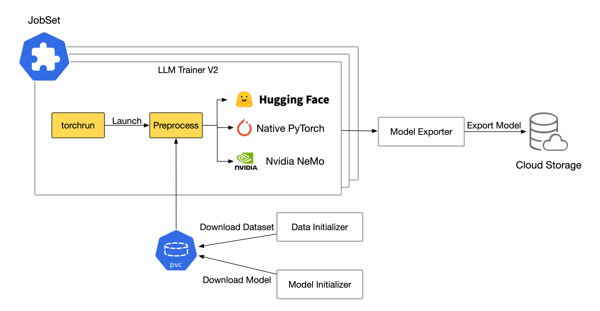

# KEP-2401: Kubeflow LLM Trainer V2

## Authors

- Shao Wang - [@Electronic-Waste](https://github.com/Electronic-Waste)

Creation date: 2025-01-31

Google doc: http://bit.ly/4gp8JGd

## Overview

This document discusses the design of LLM Trainer for [Kubeflow Training v2](../2170-kubeflow-training-v2/README.md), tracked by [this issue](https://github.com/kubeflow/training-operator/issues/2401).

**We decided to implement a custom Trainer to fine-tune LLMs, which will be supported officially via TrainingRuntimes in Kubeflow upstream**. This will greatly ease the workload of writing fine-tuning scripts, and provide an in-box toolkit to fine-tune the LLMs with custom datasets and models for Data Scientists.

(The following picture comes from the slides of [Andrey and Yuki’s talk in KubeCon NA 2024](https://kccncna2024.sched.com/event/1i7nV?iframe=no), which explains the workflow of LLM fine-tuning very well)


## Motivation

Fine-tuning LLMs on Kubernetes is challenging for Data Scientists due to the complex Kubernetes configurations, diverse fine-tuning techniques, and different distributed strategies like data and model-parallelism. It’s crucial to hide the complex infrastructure configurations from users, and allow them to gracefully shift among diverse fine-tuning techniques and distributed strategies.

By now, Kubeflow Training V1 has implemented a [Trainer for LLM](../2003-train-api/README.md) based on the HuggingFace library. However, it is **integrated with data and model initialization**, which are separated in Kubeflow Training V2, and has **limited fine-tuning mechanism support**. We need to migrate it to V2 and support more fine-tuning configurations and distributed strategies in accordance with the growing needs in custom LLM fine-tuning.

### Goals

- Introduce LLM Trainer V2 that supports some important PEFT mechanisms(e.g LoRA, QLoRA, AdapterPrompt, PrefixTuning), allows users to specify sharding strategies for distributed training like FSDP and ZeRO, and provides multiple fine-tuning frameworks including HuggingFace Transformers, Native PyTorch and Nvidia NeMo.
- Update Kubeflow Training SDK to allow users to pass their custom data preprocessing logic as a parameter and fine-tune LLMs with LLM Trainer V2 flexibly.
- Create community-supported `ClusterTrainingRuntime` for LLM fine-tuning for various foundational models (e.g. Mistral, LLama-70b, Gemma-7b).

### Non-Goals

- Upgrade LLM Trainer V1.
- Support training launchers besides `torchrun` (we can add more launchers after the initial implementation).

## Proposal

We decide to adopt `torchrun` as the launcher of LLM Trainer V2, and support multiple frameworks and fine-tuning techniques.

Supported frameworks:

1. HuggingFace Transformers: HuggingFace Transformers provides unified trainers class `Trainer` for model training, and `SFTTrainer` for supervised fine-tuning. It has rich in-box support for features like PEFT (`huggingface.peft`), FSDP (`huggingface.accelerate`), and model quantization (`huggingface.optimum`). These libraries are fully compatible with `torchrun` CLI. Since most well-known open-source LLMs lie in Huggingface and support the Transformer library, it’s convenient and acceptable to implement our LLM Trainer with the Transformer library. Our LLM Trainer V1 is also implemented in this way.

2. Native PyTorch: A backend that does not use the Trainer or SFTTrainer library in HF Transformers. This will provide users who don’t want to rely on the HF Transformers library with an alternative for fine-tuning.

3. Nvidia NeMo: To be added.

Supported fine-tuning techniques:

1. PEFT(Parameter Efficient Fine Tuning): Including LoRA, QLoRA, Adapter Prompt and Prefix Tuning.

2. Sharding Policies: Including FSDP and DeepSeed ZeRO.

The workflow of LLM Trainer V2 is shown in the graph below:



To hide users from complex Kubernetes configuations, we will provide a simple yet flexible Python SDK wrapping all specifications of models, datasets, training runtime and fine-tuning configs. Like this:

```python
TrainingClient().train(
    dataset_config=HuggingFaceDatasetConfig(
        storage_uri="tatsu-lab/alpaca",
    ),
    trainer=Trainer(
        fine_tuning_config=FineTuningConfig(
            framework="huggingface",
            dataset_class="Instruction",
            peft_config=LoraConfig(r=4),
            sharding_config=FsdpConfig(...),
            kwargs={},
        ),
        num_nodes=5,
    ),
    runtime_ref=llm_runtime,
)
```

And it's worthwhile to notice that we'll preprocess dataset for users with builtin dataset classes or a customized one. If users want to preprocess datasets by themselves, they need to implement a customized data class with specified methods implemented and pass it to the Python SDK.

In the future, we'll provide users with more options on launchers (`torchtune`, `accelerate`), frameworks (TensorFlow, Jax, etc.) and fine-tuning techniques (RLHF, Distilation, etc.).

## Design Details

### Multiple Frameworks Support

We decide to implement multiple backends for LLM Trainer launched by `torchrun`, which would be friendly with users of different fine-tuning frameworks, such as HuggingFace Transformers, Nvidia NeMo, Native PyTorch etc.

p.s. This idea comes from [Deepanker Gupta](https://github.com/deepanker13): [Support multiple backends](https://docs.google.com/document/d/1KCNqE66vc1lkecsX_Bcpz3l3d0M-jDYrwVq2nUq_5dc/edit?usp=sharing)

```python
# Registry to map backends to their respective handlers
BACKEND_HANDLERS = {}

def register_backend(name):
    def decorator(cls):
        BACKEND_HANDLERS[name] = cls()
        return cls
    return decorator

# Abstract base class for all backends
class BaseFineTuner:
    def fine_tune(self, model_name, dataset, **kwargs):
        raise NotImplementedError

# Native PyTorch Implementation
@register_backend('pytorch')
class NativePyTorchFineTuner(BaseFineTuner):
    def fine_tune(self, model_name, dataset, **kwargs):
        from torch.nn.parallel import DistributedDataParallel as DDP
        # Implement training logic here
        print(f"Training HuggingFace model {model_name}...")


# HuggingFace Implementation
@register_backend('huggingface')
class HuggingFaceFineTuner(BaseFineTuner):
    def fine_tune(self, model_name, dataset, **kwargs):
        from transformers import Trainer, TrainingArguments
        # Example: Parse Hugging Face-specific parameters
        training_args = TrainingArguments(
            output_dir=kwargs.get("output_dir", "./results"),
            learning_rate=kwargs.get("learning_rate", 5e-5),
            num_train_epochs=kwargs.get("epochs", 3),
            per_device_train_batch_size=kwargs.get("batch_size", 16),
        )
        # Implement training logic here
        print(f"Training HuggingFace model {model_name}...")

# NVIDIA NeMo Implementation
@register_backend('nemo')
class NeMoFineTuner(BaseFineTuner):
    def fine_tune(self, model_name, dataset, **kwargs):
        import nemo.collections.asr as nemo_asr
        # Example: Parse NeMo-specific parameters
        asr_model = nemo_asr.models.EncDecCTCModel.from_pretrained(model_name)
        # Implement NeMo fine-tuning logic here
        print(f"Fine-tuning NVIDIA NeMo model {model_name}...")

# Unified function
def fine_tune(model_name, dataset, backend, **kwargs):
    if backend not in BACKEND_HANDLERS:
        raise ValueError(f"Unsupported backend: {backend}")
    BACKEND_HANDLERS[backend].fine_tune(model_name, dataset, **kwargs)

```

### Data Preprocess

Different datasets have vastly different keys and usage. For example, instruction datasets (e.g. [tatsu-lab/alpaca](https://huggingface.co/datasets/tatsu-lab/alpaca)) always include keys like `instruction`, `input`, `output` and `text`. However, question answering datasets (e.g. [openai/gsm8k](https://huggingface.co/datasets/openai/gsm8k)) contain columns like `question` and `answer`. It’s impossible to implement a unified dataset class suitable for every datasets on HuggingFace. **Different types of tasks need different implementations** so that they can preprocess data in a specific way.

Based on the reasons above, we decide to **provide multiple built-in dataset classes** for data processing. They can be used directly by specifying the `dataset_class` parameter in Python SDK (e.g. `dataset_class="instruction"`). Meanwhile, we also **allow users to define customized dataset classes with specified methods implemented** and pass it to the `dataset_class` parameter in Python SDK (e.g. `dataset_class=CustomDatasetClass`).

```python
from torch.utils.data import Dataset

DATASET_REGISTRY = {}

def register_dataset(name):
    def decorator(cls):
        DATASET_REGISTRY[name] = cls
        return cls
    return decorator

# Abstract Dataset Class
class InitMethod(ABC):
    @abstractmethod
    def __init__(self, dataset_config, tokenizer, partition="train"):
        raise NotImplementedError()

@register_dataset("instruction")
class InstructionDataset(Dataset, InitMethod):
    def __init__(self, dataset_config, tokenizer, partition="train"):
        # Some code here

    def __len__(self):
        # Some code here

    def __getitem__(self, index):
        # Some code here

```

### Fine-Tuning Config

We will add the fine-tuning configurations in the `fine_tuning_config` field in `Trainer` dataclass.

| Parameters | What is it? |
| - | - |
| framework | Framework for fine-tuning. |
| dataset_class | Dataset class adopted to fine-tune the LLM. |
| peft_config | Configuration for the PEFT(Parameter-Efficient Fine-Tuning), including Lora, AdapterPrompt, PrefixTuning, etc. |
| sharding_config | Configuration for sharding policy for distributed training, such as FSDP(Fully Shared Data Parallel) and ZeRO(Zero Redundancy Optimizer). |
| kwargs | Some other backend-specific and launch-CLI-specific parameters. |

```python
# FineTuningConfig DataClass
@dataclass
class FineTuningConfig:
    framework: str = "huggingface"
    dataset_class: Union[str, Dataset] = "InstructionDataset"
    peft_config: Optional[Union[LoraConfig, QLoraConfig, AdapterConfig, PrefixConfig]] = None
    sharding_config: Optional[Union[FsdpConfig, ZeroConfig]] = None
    kwargs: Optional[Dict[str, str]] = None

```

The Python SDK will look like:

```python
job_id = TrainingClient().train(
    dataset_config=HuggingFaceDatasetConfig(
        storage_uri="tatsu-lab/alpaca",
    ),
    trainer=Trainer(
        fine_tuning_config=FineTuningConfig(
            framework="huggingface",
            dataset_class="InstructionDataset",
            peft_config=LoraConfig(r=4),
            sharding_config=FsdpConfig(...),
            kwargs={},
        ),
        num_nodes=5,
    ),
    runtime_ref=llm_runtime,
)

```

#### LoRA Config

The *LoraConfig* represents the config of LoRA we use to fine-tune the model.

| Parameters | What is it? |
| - | - |
| r | The rank of the low rank decomposition. |
| lora_alpha | The scaling factor that adjusts the magnitude of the low-rank matrices’ output |
| lora_dropout | The probability of applying Dropout to the low rank updates |

#### QLoRA Config

The *QLoraConfig* represents the config of QLoRA we use to fine-tune the model.

| Parameters | What is it? |
| - | - |
| r | The rank of the low rank decomposition. |
| lora_alpha | The scaling factor that adjusts the magnitude of the low-rank matrices’ output |
| lora_dropout | The probability of applying Dropout to the low rank updates |
| quant_type | The quantization type, supporting nf4 and fp4 |
| use_double_quant | Whether to enable double quantization |
| compute_dtype | Actual data type in the computing phase |
| quant_storage | Actual data type in the storage phase |

```python
# QLoraConfig DataClass
@dataclass
class QLoraConfig:
    r: Optional[int] = None
    lora_alpha: Optional[int] = None
    lora_dropout: Optional[float] = None
    quant_type: str = "fp4" # fp4 or nf4
    use_double_quant: bool = False
    compute_dtype: torch.dtype = torch.bfloat16
    quant_storage: torch.dtype = torch.bfloat16

```

#### AdapterPrompt Config(TBD)

The *AdapterConfig* represents the config of AdapterPrompt we use to fine-tune the model.

| Parameters | What is it? |
| - | - |
| adapter_len | The length of adapter |
| adapter_layers | The number of layers that we insert adapter |

```python
# AdapterConfig DataClass
@dataclass
class AdapterConfig:
    adapter_len: int = 10
    adapter_layers: int = 30

```

#### PrefixTuning Config

The *PrefixConfig* represents the config of PrefixTuning we use to fine-tune the model.

| Parameters | What is it? |
| - | - |
| num_virtual_tokens | The number of virtual tokens |

```python
# PrefixConfig DataClass
@dataclass
class PrefixConfig:
    num_virtual_tokens: int = 30

```

#### FSDP Config

The *FsdpConfig* represents the config of FSDP we use to fine-tune the model.

| Parameters | What is it? |
| - | - |
| mixed_precision | Whether to enable mixed precision training |
| use_fp16 | Whether to use FP16 during the mixed precision training |
| fsdp_cpu_offload | Whether to offload some weights and optimizer states to cpu |
| sharding_strategy | The sharding strategy for FSDP, e.g. FULL_SHARD (default), HYBRID_SHARD, SHARD_GRAD_OP, NO_SHARD. |
| hsdp | Whether to enable Hybrid Shard Data Parallel (HSDP) |
| sharding_group_size | Specify the GPU num in the sharding group when hsdp set to true |
| replica_group_size | The number of sharding groups |
| checkpoint_type | Specify the type of model checkpoints |
| fsdp_activation_checkpointing | Whether to enable Activation Checkpointing |

```python
# FsdpConfig DataClass
@dataclass
class FsdpConfig:
    mixed_precision: bool = True
    use_fp16: bool = False
    fsdp_cpu_offload: bool=False
    sharding_strategy: ShardingStrategy = ShardingStrategy.FULL_SHARD
    hsdp: bool = False
    sharding_group_size: int = 0 # requires hsdp to be set.
    replica_group_size: int = 0 #requires hsdp to be set.
    checkpoint_type: StateDictType = StateDictType.SHARDED_STATE_DICT
    fsdp_activation_checkpointing: bool = True

```

#### ZeRO Config

The *ZeroConfig* represents the config of DeepSeed ZeRO we use to fine-tune the model.

| Parameters | What is it? |
| - | - |
| stage | The stage of DeepSeed ZeRO. |
| zero_cpu_offload | Whether to offload some weights and optimizer states to cpu |
| checkpoint_type | Specify the type of model checkpoints |
| mixed_precision | Whether to enable mixed precision training |
| use_fp16 | Whether to use FP16 during the mixed precision training |

```python
# ZeroConfig DataClass
@dataclass
class ZeroConfig:
    stage: int = 0
    zero_cpu_offload: bool = False
    checkpoint_type: StateDictType = StateDictType.SHARDED_STATE_DICT
    mixed_precision: bool = True
    use_fp16 : bool = False

```

## Implementation History

- 2025-01-31: Create KEP-2401 doc

## Alternatives

### Native PyTorch Launcher - `torchtune`

`torchtune` is a PyTorch-native library for easily authoring, fine-tuning and experimenting with LLMs. It provides rich support for LLM fine-tuning:

1. Modular native-PyTorch implementations of popular LLMs
2. Training recipes for a variety of fine-tuning techniques
3. Support for distributed training using [FSDP2](https://github.com/pytorch/torchtitan/blob/main/docs/fsdp.md)
4. YAML configs for easily configuring training runs

`torchtune` is something like our LLM Trainer, because its [core concepts](https://pytorch.org/torchtune/main/overview.html#key-concepts) "recipes" and "configs" can be easily corresponded to our “LLM Trainer Script” and “[Trainer field in TrainJob](https://github.com/kubeflow/training-operator/blob/cf741267f8f8ec96592178532b6787bab3f11110/pkg/apis/kubeflow.org/v2alpha1/trainjob_types.go#L110-L111)”. **It’s the easiest way for us to implement the LLM Trainer**.

**However, `torchtune` only supports single-node training**, which means that we can only have 1 pod in the training phase (`--nnodes=1`, [related issue](https://github.com/pytorch/torchtune/issues/2018)). This would put a strong restriction for us on scaling training pods on Kubernetes. And also, **it only supports some popular LLMs** and will bring inflexibility for us to fine-tune other models.

An example for using `torchtune`:

```bash
$ tune ls
RECIPE                                   CONFIG
full_finetune_single_device              llama2/7B_full_low_memory
                                         mistral/7B_full_low_memory
full_finetune_distributed                llama2/7B_full
                                         llama2/13B_full
                                         mistral/7B_full
lora_finetune_single_device              llama2/7B_lora_single_device
                                         llama2/7B_qlora_single_device
                                         mistral/7B_lora_single_device

$ tune run lora_finetune_single_device --config llama2/7B_lora_single_device epochs=1
INFO:torchtune.utils.logging:Running LoRAFinetuneRecipeSingleDevice with resolved config:
Writing logs to /tmp/lora_finetune_output/log_1713194212.txt
INFO:torchtune.utils.logging:Model is initialized with precision torch.bfloat16.
INFO:torchtune.utils.logging:Tokenizer is initialized from file.
INFO:torchtune.utils.logging:Optimizer and loss are initialized.
INFO:torchtune.utils.logging:Loss is initialized.
INFO:torchtune.utils.logging:Dataset and Sampler are initialized.
INFO:torchtune.utils.logging:Learning rate scheduler is initialized.
1|52|Loss: 2.3697006702423096:   0%|▏                     | 52/25880 [00:24<3:55:01,  1.83it/s]
```

(**Note**: We need to create a new plugin for `torchtune`, so that it can fit in the yaml-based fine-tuning configurations. And also we may need to explore how to integrate the recipes provided by `torchtune`.)

### HF Accelerate CLI - `accelerate`

Huggingface Accelerate CLI is a simplified distributed training launch tool, which is **targeted to junior users not familiar with distributed training**. The official slogan for Huggingface Accelerate is “Run your raw PyTorch training script on any kind of device”. There are several advantages to adopt it:

1. In-box support for HuggingFace Transformers and Datasets libraries
2. Set many proper default values for mixed-precision training and device allocation
3. Hide some complex configurations like communication backend & env variables.

**If we decide to support HF Accelerate CLI, we need to implement a new runtime plugin**. And also, users will lose their control over the training process, which is unacceptable if they want to have more flexibility and set up their own configurations in the distributed training phase.

If time permitted, it would be great to build our impacts among junior learners by a simple distributed training backend.

```python
import torch
  import torch.nn.functional as F
  from datasets import load_dataset
+ from accelerate import Accelerator

- device = 'cpu'
+ accelerator = Accelerator()

- model = torch.nn.Transformer().to(device)
+ model = torch.nn.Transformer()
  optimizer = torch.optim.Adam(model.parameters())

  dataset = load_dataset('my_dataset')
  data = torch.utils.data.DataLoader(dataset, shuffle=True)

+ model, optimizer, data = accelerator.prepare(model, optimizer, data)

  model.train()
  for epoch in range(10):
      for source, targets in data:
-         source = source.to(device)
-         targets = targets.to(device)

          optimizer.zero_grad()
          output = model(source)
          loss = F.cross_entropy(output, targets)

-         loss.backward()
+         accelerator.backward(loss)

          optimizer.step()

```

```bash
$ accelerate config
-------------------------------------------------------------------------------------------------------------------------------------In which compute environment are you running?
This machine
-------------------------------------------------------------------------------------------------------------------------------------Which type of machine are you using?
multi-CPU
How many different machines will you use (use more than 1 for multi-node training)? [1]:
Should distributed operations be checked while running for errors? This can avoid timeout issues but will be slower. [yes/NO]: yes
Do you want to use Intel PyTorch Extension (IPEX) to speed up training on CPU? [yes/NO]:yes
Do you want accelerate to launch mpirun? [yes/NO]: no
Do you wish to optimize your script with torch dynamo?[yes/NO]:yes
-------------------------------------------------------------------------------------------------------------------------------------Which dynamo backend would you like to use?
Please select a choice using the arrow or number keys, and selecting with enter
inductor
Do you want to customize the defaults sent to torch.compile? [yes/NO]: yes
-------------------------------------------------------------------------------------------------------------------------------------Which mode do you want to use?
default
Do you want the fullgraph mode or it is ok to break model into several subgraphs? [yes/NO]: yes
Do you want to enable dynamic shape tracing? [yes/NO]: yes
How many processes should be used for distributed training? [1]:1
-------------------------------------------------------------------------------------------------------------------------------------Do you wish to use mixed precision?
fp16
accelerate configuration saved at /home/xxx/.cache/huggingface/accelerate/default_config.yaml

$ accelerate launch {my_script.py}
```

### Backend Design - `torchtune`

#### New Runtime Plugin

As is shown in the [torchtune official document](https://pytorch.org/torchtune/main/tune_cli.html#run-a-recipe) and [source code](https://github.com/pytorch/torchtune/blob/75965d4281b9b76c454630d015221b9933c77bf3/torchtune/_cli/run.py#L113-L118), the distributed training arguments like `--nnodes` and `--nproc_per_node` should be passed ahead of the recipe argument in the command line, and **cannot be passed by the environment variables** in the `PET_XXX` convention. And also, `torchtune` is extremely different from the fine-tuning paradigm of `torchrun` because it is **recipe and config-based**, which may need more mutation operations in the config file. Here is an [example](https://github.com/Electronic-Waste/kubeflow-llm-trainer/blob/main/torchtune-llm-finetuning.yaml).

Thus, we need to implement a new plugin for `torchtune` if we decide to adopt `torchtune` as a launcher for LLM fine-tuning on Kubernetes. And the new plugin should have these abilities:

1. Parse distributed training arguments in TrainJob and TrainingRuntime API, and integrate them with the `tune run` command.
2. Handle overrides in the `torchtune` fine-tuning configuration file.
3. Validate some requirements, such as `--nnodes` should be equal to 1.

\# WIP
