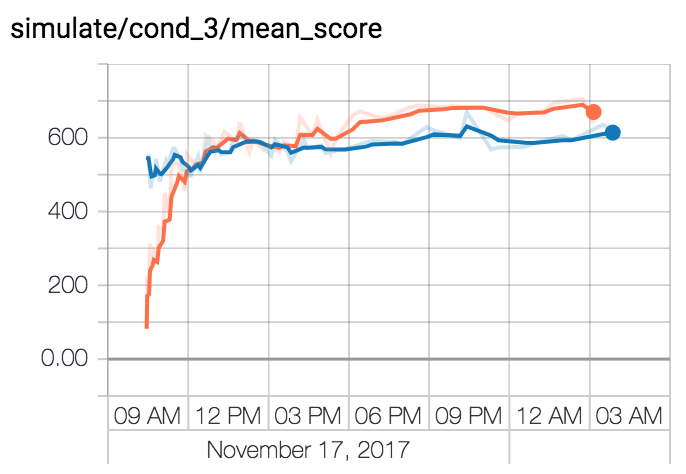

# Tensorflow/agents

Running a [tensorflow/agents](https://github.com/tensorflow/agents) job on kubernetes using the tf/k8s CRD. This example illustrates between-graph [synchronous](https://www.tensorflow.org/api_docs/python/tf/train/SyncReplicasOptimizer) [replicated](https://www.tensorflow.org/deploy/distributed#replicated_training) training.

# Training a model

A TfJob YAML can be configured and run using jinja2 and kubectl:

```bash
LOG_DIR=<gcs-bucket-path>
# e.g. gs://${PROJECT_ID}-k8s/logs/tf-v2017111800001
AGENTS_CPU=gcr.io/dev01-181118-181500/agents:cpu
jinja2 deployment.yaml.template \
   -D image=${AGENTS_CPU} \
   -D job_name=tfagents \
   -D log_dir=${LOG_DIR} \
   -D environment=pybullet_ant \
   -D mode=train \
   | kubectl create -f -
```

This runs a job using the tensorflow/agents example container. To deploy and train custom models you'll need to build and deploy your own container such as via the following:

```bash
gcloud container builds submit \
  --tag gcr.io/<gcloud-project-id>/agents:cpu .
```

Example tensorboard results can be accessed via the following

```bash
gsutil -u <your-project-to-bill-for-xfer> gs://agents-k8s-share/jobs/tensorflow-20171117102413/20171117T182424-pybullet_ant <your-target-dir-or-bucket>
tensorboard --logdir <your-target-dir-or-bucket>
```

for example showing the training and eval mean score vs. wall time



# Rendering

A render job can be initiated as follows, templating the '--mode render' argument into the job YAML with the following

```bash
jinja2 deployment.yaml.template \
   -D image=${AGENTS_CPU} \
   -D job_name=tfagents-render \
   -D log_dir=${LOG_DIR} \
   -D environment=pybullet_ant \
   -D mode=render \
   | kubectl create -f -
```

(TODO: Update with gif of render when finished)
