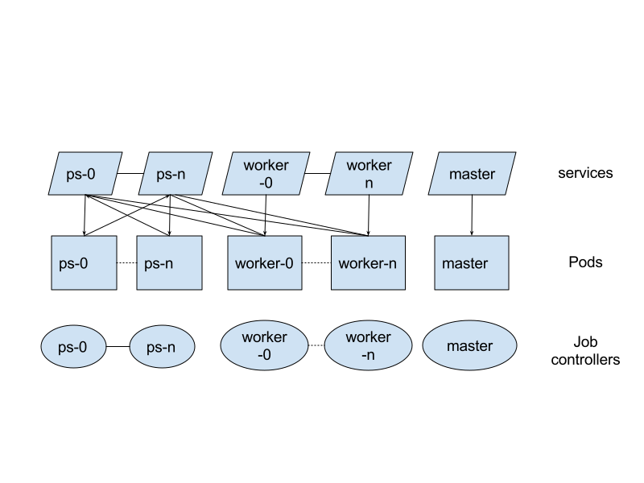

# Design Doc TFJob K8s CRD


# Objective

The goal is to make it easy to run TensorFlow training (and distributed training in particular) on Kubernetes (K8s). I propose doing this by creating a K8s custom resource descriptor (CRD) and associated controller. The CRD takes care of managing the K8s resources needed to run a training job.

# Background

Kubernetes makes it easy to manage processes by providing a process (as opposed to VM centric) view of the world. Kubernetes also provides essential building blocks for complex distributed applications. For example, K8s provides built in support for DNS, health checking, logs collections, metrics collection, storage, etc....

In K8s, [Controllers](https://kubernetes.io/docs/concepts/workloads/controllers/replicaset/) are responsible for ensuring a set of [Pods](https://kubernetes.io/docs/concepts/workloads/pods/pod-overview/) are running. A Pod is the basic building block in K8s and describes one or more processes that should be colocated (same ip). K8s comes with a number of built in controllers. For example, a [ReplicaSet](https://kubernetes.io/docs/concepts/workloads/controllers/replicaset/) can ensure N Pods are running with a particular specification. A [Job controller](https://kubernetes.io/docs/concepts/workloads/controllers/jobs-run-to-completion/) can be used to run a binary to completion.

The built in [Controllers](https://kubernetes.io/docs/concepts/workloads/controllers/replicaset/) are insufficient for running a distributed TensorFlow job. TensorFlow is a stateful application; each parameter server and worker needs to be uniquely addressable to support all the different patterns of distributed training. K8s has a [stateful sets controller](https://kubernetes.io/docs/concepts/workloads/controllers/statefulset/). However,  stateful sets are intended for stateful services that run forever (e.g. a sharded in memory cache service like Redis) as opposed to jobs intended to run to completion.

Consequently, running a distributed TF job on K8s today means cobbling together a solution out of the built in primitives. Typically, this means managing multiple resources manually. For example, a user could create 1 stateful set for parameter servers, 1 stateful set for the workers, and 1 job for the master.

To address the limitations of the built in resources,  K8s supports [Custom Resources (CRD) and Controllers.](https://kubernetes.io/docs/concepts/api-extension/custom-resources/) Using a CRD, it is easy to create a controller with the desired semantics for a particular workload while hiding users from the implementation.  The K8s community has quickly adopted this pattern contributing [numerous CRDs](https://github.com/coreos/awesome-kubernetes-extensions) for various workloads.


# Requirements and Scale

I think O(100) jobs is a reasonable upper bound for the number of TF training jobs the average K8s customer will be running simultaneously in a single cluster.

The input from the K8s team that developed CRDs and various controllers is that most controllers use a non-distributed, multi-threaded design and that scaling is not a problem.


# Design


## TFJob Resource

The TFJob CRD defines a TFJob resource for K8s.
The [TFJob](https://github.com/tensorflow/k8s/blob/master/pkg/spec/tf_job.go#L55)
resource is a collection of TfReplicas. Each TfReplica corresponds to a
set of TensorFlow processes performing a role in the job;
e.g. master, parameter server or worker. The set of replica types can be expanded (it is just an enum) to support new TF patterns such as eval workers. Figure 1. shows an example yaml spec for a distributed job.


```
apiVersion: "kubeflow.org/v1alpha1"
kind: "TFJob"
metadata:
  name: "example-job"
spec:
  tensorboard:
    logDir: gs://my-job/log-dir
  replicaSpecs:
    - replicas: 1
      tfReplicaType: MASTER
      template:
        spec:
          containers:
            - image: gcr.io/tf-on-k8s-dogfood/tf_sample:dc944ff
              name: tensorflow
              args:
                - --log_dir=gs://my-job/log-dir
          restartPolicy: OnFailure
    - replicas: 2
      tfReplicaType: WORKER
      template:
        spec:
          containers:
            - image: gcr.io/tf-on-k8s-dogfood/tf_sample:dc944ff
              name: tensorflow
              args:
                - --log_dir=gs://my-job/log-dir
          restartPolicy: OnFailure
    - replicas: 1
      tfReplicaType: PS
```
**Fig 1.** An example job spec for a distributed Training job with 1 master, 2 workers and 1 PS. TensorBoard is configured by specifying the location of the event files.

As illustrated by Fig 1, I made an explicit decision not to try to hide or replace K8s abstractions. For example, each TfReplica contains a standard K8s [PodTemplate](https://kubernetes.io/docs/api-reference/v1.7/#podtemplate-v1-core) to specify the processes (including TF) to run in each replica. I did this because K8s already provides a widely adopted and understood API. So introducing new concepts in place of K8s concepts is just confusing. Furthermore, exposing the [PodTemplate](https://kubernetes.io/docs/api-reference/v1.7/#podtemplate-v1-core) makes it easy for TFJob users to leverage K8s features. For example, TFJob users can use K8s to attach volumes to their TF processes. This makes it easy to use TF in conjunction with any storage system supported by K8s (e.g. PDs, NFS, etc...)

**Defaults**

The controller can be used to configure defaults for TFJob to create a simpler user experience. The most common use for this right now is supporting GPUs. To use GPUs, the NVIDIA drivers and libraries need to be mounted from the host into the container. This step should become unnecessary with Kubernetes 1.8. The TFJob controller will automatically add these volume mounts based on configuration specified when the controller is started. This prevents users from having to specify them for each job. Instead, only the cluster administrator who deploys the TFJob controller needs to know how the volumes should be configured.

Another use case is minimizing the boilerplate users have to write to run standard processes (e.g. [Parameter Servers](https://github.com/tensorflow/k8s/pull/36#discussion_r141135711) or TensorBoard) using official TF Docker images.


## Controller

The controller manages a distributed TFJob by creating a series of Job controllers Fig 2. The TFJob controller sets the environment variable TF_CONFIG to make the TensorFlow cluster spec and replica type (PS, WORKER, MASTER) and replica index available to TensorFlow code. The Job controller takes care of restarting TensorFlow processes that terminate due to an error. Additional logic in the TFJob controller looks at exit codes and fails the job if a TF process exits with an exit code indicating a permanent error. The TFJob controller treats exit codes of 1-127 as permanent errors; this is an arbitrary convention.

When the master exits successfully or with a permanent error the job is considered finished. There is an open issue([issues/61](https://github.com/tensorflow/k8s/issues/61)) to make the changes necessary to support evaluation with the Estimator API in 1.4.  The pods aren't deleted until the TFJob is deleted. This allows the logs to be fetched via kubectl logs.




## TensorBoard

If a user specifies the log dir as part of the TFJob spec, then the TFJob controller will launch TensorBoard as part of the job. TensorBoard will run until the job is deleted. A service is also created to give the TensorBoard process a stable DNS name. The DNS name is a deterministic function of the job name; the port is always the same e.g. 80. The user can list services to find the relevant one. Nonetheless, the experience today is still rough, especially when a user has lots of jobs in the cluster. I expect that we will make various usability improvements; for example we might publish the relevant URI for accessing TensorBoard in the TFJob status.


## Non-distributed training

A TFJob can handle non-distributed training; the TFJob spec would consist of a single replica of type master.


## in-graph replication

The current design can handle in-graph replication. In-graph vs between-graph replication is determined by the code the user runs in the workers and master.


## Testing

TFJob is using [Prow](https://github.com/kubernetes/test-infra), K8s test infrastructure, to run E2E tests continuously; e.g. presubmits, postsubmits etc... The K8s test-infra team has allowed us to use the Prow instance they maintain so we don't need to support our own instance.

One advantage of Prow over Jenkins is that its API is Kubernetes centric meaning it uses concepts (e.g. Pods, Secrets, etc...) that are very familiar to K8s developers. So Prow is much more intuitive to TFJob developers than Jenkins.


# Alternatives Considered


## Helm and/or Ksonnet

Rather than use a CRD, we could use a tool like Helm or Ksonnet to create templates to simplify creating the different K8s resources needed to manage a TensorFlow job. This is in line with the current approach in [tensorflow/ecosystem](https://github.com/tensorflow/ecosystem/tree/master/kubernetes).

One disadvantage of templates is that they do not provide a mechanism to add custom control logic.  None of the K8s builtin controllers provide a mechanism for distinguishing between retryable and permanent errors. Furthermore, the built in controllers don't propagate errors; if worker i fails with a permanent error this error won't cause the parameter servers and master controllers to be terminated.

Another major disadvantage is that the templating approach forces users to manually manage multiple K8s resources.

